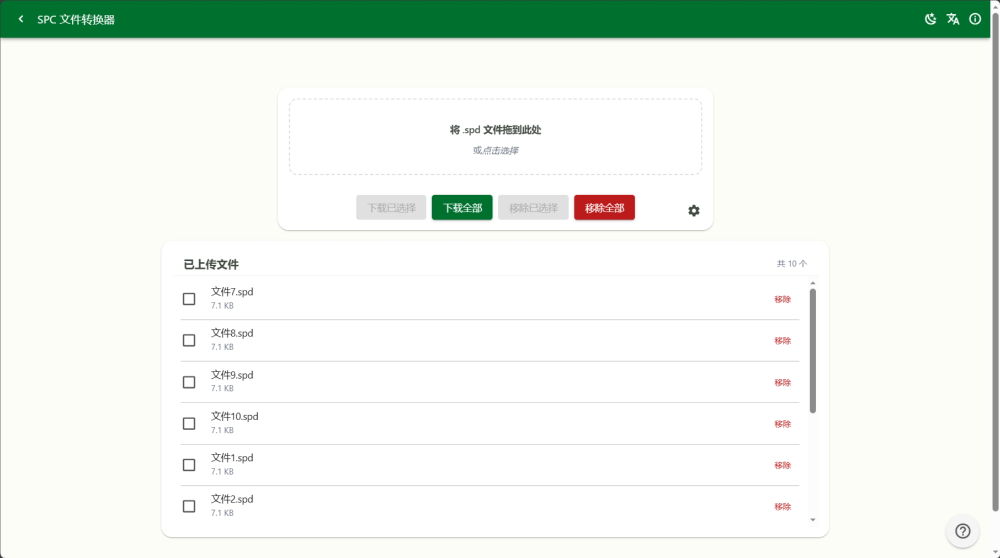
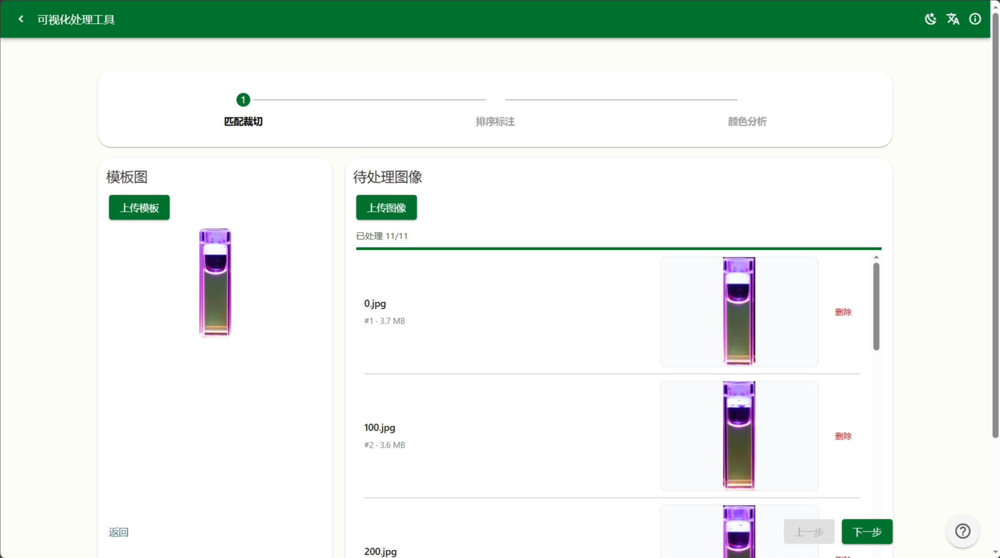
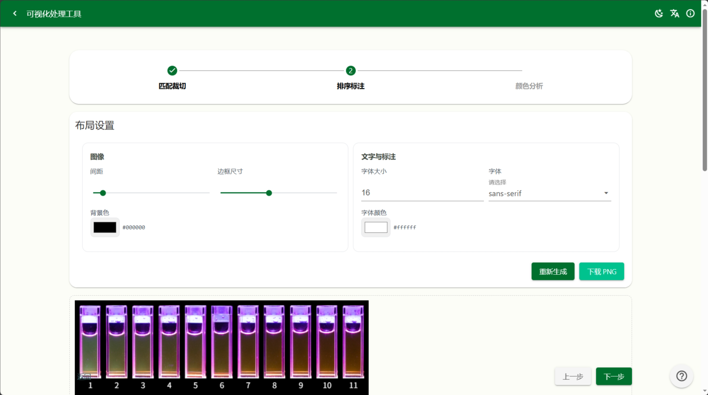
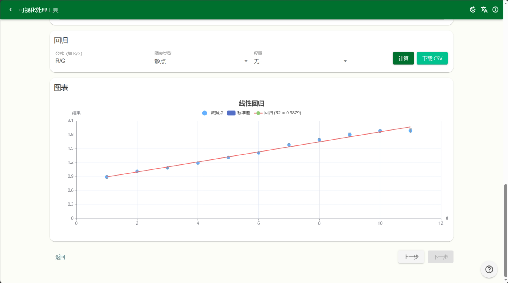

# 🧰 Toolbox - 实验室数据处理工具箱

专为科研人员和实验室工作者设计的在线工具集，提供光谱数据转换和图像处理分析功能。完全基于浏览器运行，无需安装，数据本地处理，保护您的隐私。

> 💡 **纯前端应用** · 所有数据处理都在您的浏览器中完成，不会上传到任何服务器

## ✨ 主要功能

### 📊 SPD 光谱文件转换器

**解决什么问题？**  
实验室仪器导出的 `.spd` 光谱数据文件难以在 Excel 等常用软件中打开和分析。

**如何使用？**
1. 将 `.spd` 文件拖入上传区域（支持批量上传）
2. 自动解析并转换为 CSV 格式
3. 下载单个文件或批量打包下载

**特色功能：**
- ✅ 支持批量处理，节省时间
- ✅ 可选自动下载，处理完成即刻获取
- ✅ ZIP 打包下载，方便管理大量文件
- ✅ 拖拽上传，操作简便



---

### 🖼️ FL 可视化图像处理工具

帮助您快速完成图像的批量处理、拼接和颜色分析，特别适合需要处理大量实验图片的场景。

#### 步骤 1：智能匹配与裁切

**解决什么问题？**  
批量实验照片中，目标区域位置不一致，需要逐一手动裁切，费时费力。

**如何使用？**
1. 上传一张包含目标区域的模板图片
2. 批量上传需要处理的图片
3. 系统自动识别并裁切出相同区域
4. 支持拖拽调整裁切结果的顺序

**智能识别：** 使用先进的图像匹配算法，自动定位并裁切目标区域



#### 步骤 2：图片拼接合并

**解决什么问题？**  
需要将多张小图排列组合成一张大图，便于对比观察。

**如何使用？**
1. 自动载入上一步裁切的图片
2. 拖拽调整排列顺序
3. 一键合并为大图
4. 下载合并结果

**灵活排版：** 自由调整图片顺序，满足不同展示需求



#### 步骤 3：颜色识别与阵列分析

**解决什么问题？**  
需要对实验样品的颜色变化进行定量分析和统计；当涉及多组对照实验时，需要对比不同公式、不同采样参数下的结果差异。

**如何使用？**

**常规模式：**
1. 载入合并后的图片或直接上传
2. 在图片上点击放置采样点
3. 为每个采样点编号（num），输入计算公式
4. 运行后查看散点图/柱状图，数据自动拟合回归曲线

**阵列模式（实验级·新增）：**
1. 开启"阵列模式"开关
2. 添加多个 **Batch（批次）**，每个 Batch 可独立配置：
   - **公式**：用于该 Batch 中每个采样点的像素 RGB 计算
   - **采样大小**：每个采样点的范围（像素）
   - **随机种子**：子像素采样的随机种子，确保可复现
3. 在画布上点击放置采样点，为每个点设置 `num` 值
   - 支持填充同步：切换开关后，第一个 Batch 的 num 值自动同步到其余 Batch
   - 按 Enter 自动跳转到下一个采样点（跨 Batch）
4. 点击"运行所有 Batch"，每个采样点将在其范围内多次采样子像素并计算
5. 进行**机器学习降维分析**：
   - **PCA（主成分分析）**：将多 Batch 结果降维到 2D，查看样本分布
   - **LDA（线性判别分析）**：以 `num` 为类别标签，最大化类间分离度，投影到 2D 空间
6. 降维结果散点图按 `num` 值自动分组着色，支持悬停查看详情

**特色功能：**
- ✅ 多 Batch 独立采样与计算，互不干扰
- ✅ PCA / LDA 降维可视化，发现样本间关系
- ✅ 按 `num` 值分组着色，直观对比同编号样本
- ✅ 画布缩放（25%–500%），精细控制采样位置
- ✅ 跨 Batch 的 Enter 快速输入，批量操作更高效
- ✅ 子像素采样 + 随机偏移，提高数据质量



## 🛠 技术栈

### 核心框架
- **Vue 3.5.21** - 渐进式 JavaScript 框架
- **TypeScript 5.8.3** - 类型安全的 JavaScript 超集
- **Vite 7.1.7** - 新一代前端构建工具

### UI 组件库
- **Varlet UI 3.12.3** - Material Design 风格的 Vue 3 组件库
- **Element Plus 2.11.4** - 企业级 Vue 3 UI 组件库
- **Font Awesome 6.7.2** - 图标库

### 核心依赖
- **Vue Router 4.6.3** - Vue 官方路由管理器
- **Vue i18n 9.14.5** - 国际化插件
- **OpenCV.js** - 图像处理库
 - **ECharts 5.5.1** - 数据可视化库
 - **ml-pca 5.0.0** - 主成分分析（PCA）降维
 - **JSZip 3.10.1** - ZIP 文件处理
- **Markdown-it 14.1.0** - Markdown 解析器
- **SortableJS 1.15.6** - 拖拽排序库
- **VueUse 14.0.0** - Vue 组合式 API 工具集

## 📦 快速开始

### 环境要求
- Node.js >= 16.0.0
- npm >= 7.0.0 或 pnpm/yarn

### 安装

```bash
# 克隆项目
git clone https://github.com/SineLi/toolbox-vue.git

# 进入项目目录
cd toolbox-vue

# 安装依赖
npm install
```

### 开发

```bash
# 启动开发服务器
npm run dev
```

应用将在 `http://localhost:5173` 运行

### 构建

```bash
# 生产环境构建
npm run build

# 预览构建结果
npm run preview
```

构建产物将输出到 `dist/` 目录

## 📁 项目结构

```
toolbox-vue/
├── public/                      # 静态资源
├── src/
│   ├── assets/                  # 资源文件
│   │   ├── fl-image-processor/  # 图像处理资源
│   │   └── opencv/              # OpenCV.js 库
│   ├── components/              # Vue 组件
│   │   ├── AppShell.vue         # 应用外壳
│   │   ├── InfoCenter.vue       # 信息中心
│   │   ├── SpcFileConverter.vue # SPC 转换器
│   │   ├── ToolDocDrawer.vue    # 文档抽屉
│   │   └── fl-image-processor/  # 图像处理组件
│   │       ├── ImageMerge.vue
│   │       ├── ImageRegression.vue
│   │       └── MatchAndCrop.vue
│   ├── views/                   # 页面视图
│   │   ├── HomeLauncher.vue     # 首页
│   │   └── FlImageProcessor.vue # FL 处理页面
│   ├── docs/                    # 文档资源
│   │   └── tools/
│   │       ├── fl/              # FL 工具文档
│   │       │   ├── usage.zh.md
│   │       │   ├── usage.en.md
│   │       │   ├── example/
│   │       │   └── img/
│   │       └── spc/             # SPC 工具文档
│   │           ├── usage.zh.md
│   │           └── usage.en.md
│   ├── locales/                 # 国际化文件
│   │   ├── zh.ts                # 中文
│   │   └── en.ts                # 英文
│   ├── types/                   # TypeScript 类型定义
│   │   ├── opencv.d.ts
│   │   ├── seedrandom.d.ts
│   │   └── varlet-style.d.ts
│   ├── logs/                    # 日志和文档
│   ├── App.vue                  # 根组件
│   ├── main.ts                  # 应用入口
│   ├── router.ts                # 路由配置
│   ├── i18n.ts                  # i18n 配置
│   └── style.css                # 全局样式
├── index.html                   # HTML 模板
├── vite.config.ts               # Vite 配置
├── tsconfig.json                # TypeScript 配置
└── package.json                 # 项目配置
```

## 🌍 国际化

项目内置中英文双语支持：

- 🇨🇳 简体中文 (zh)
- 🇬🇧 English (en)

语言设置会自动保存在 Cookie 中，下次访问时自动加载用户偏好。

## 🚀 性能优化

### 代码分割策略
```javascript
manualChunks: {
  'echarts': ['echarts'],              // ECharts 单独分块
  'vendor': ['vue', 'vue-router', ...], // 核心库
  'ui-extra': ['element-plus', ...]     // UI 库
}
```

### 构建优化
- ✅ Terser 压缩，生产环境自动移除 console
- ✅ Rollup 可视化分析器 (dist/stats.html)
- ✅ 组件和 API 自动导入
- ✅ Gzip 和 Brotli 压缩支持

## 📚 使用指南

### SPC 文件转换器

1. 访问 `/spc-converter` 路由
2. 拖拽或点击上传 `.spd` 文件
3. 等待自动解析
4. 选择文件并下载（支持单个或批量 ZIP）

### FL 图像处理工具

1. 访问 `/fl-image-processor` 路由
2. 按流程操作：
   - **匹配裁切**：上传模板和待处理图片，自动裁切目标区域
   - **图像合并**：排序并拼接裁切后的图片
   - **颜色分析**：
     - **常规模式**：放置采样点 → 输入公式 → 回归分析
     - **阵列模式**：多 Batch 独立采样 → 运行全部 → PCA/LDA 降维分析
3. 阵列模式开启后，可在 Batch 管理卡中添加/删除/切换 Batch，所有采样和计算均实时反映在画布和图表中

详细使用说明请查看应用内的"使用说明"按钮。

## 🔌 自动导入

项目配置了 `unplugin-auto-import` 和 `unplugin-vue-components`：

- Varlet UI 组件自动导入
- Element Plus 组件自动导入
- Vue API 按需自动导入

无需手动 import，直接使用即可！

## 🛡️ 类型支持

完整的 TypeScript 类型定义：
- `opencv.d.ts` - OpenCV.js 类型
- `seedrandom.d.ts` - 随机数生成器类型
- `varlet-style.d.ts` - Varlet 样式类型

自动生成的类型文件：
- `auto-imports.d.ts` - 自动导入的类型
- `components.d.ts` - 组件类型


> 本文档由人工智能生成